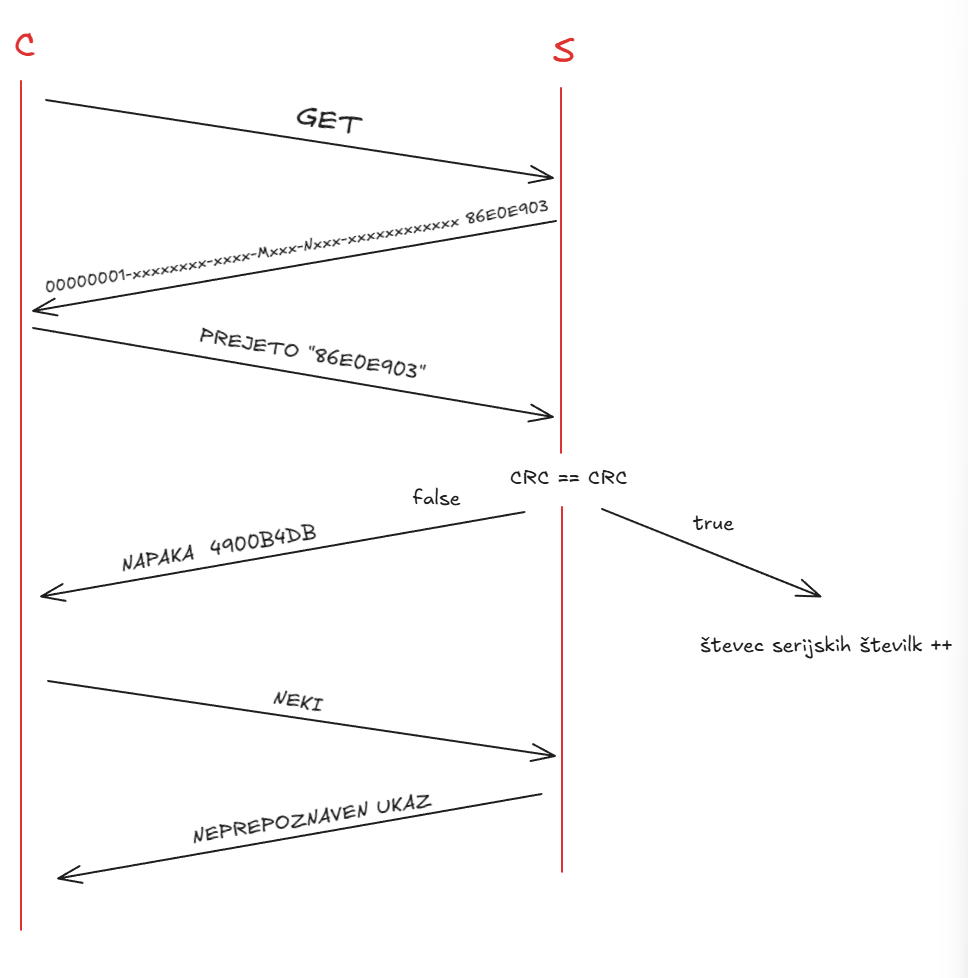

# DN 2 Case - UDP Client-Server z CRC32 Preverjanjem

## Opis projekta

Projekt implementira UDP komunikacijo med odjemalcem in strežnikom s preverjanjem integritete podatkov preko CRC32 kontrolne vsote. Sistem omogoča generiranje UUID-jev in njihovo varno izmenjavo z vgrajenim mehanizmom preverjanja napak.

## Diagram poteka



## Struktura projekta

```
dn_2_case/
├── client.c              # Glavni UDP odjemalec z CRC32 preverjanjem
├── server.c              # Glavni UDP strežnik z generiranjem UUID
├── asihron_client.c      # Asinhroni UDP odjemalec (select)
├── asinhron_server.c     # Asinhroni UDP strežnik (select)
├── diagram_poteka.png    # Diagram komunikacijskega poteka
└── README.md             # Ta datoteka
```

## Funkcionalnosti

### Server (server.c)

- **Port**: 5069
- **Protokol**: UDP (SOCK_DGRAM)
- **Glavne funkcije**:
  - `genUUID()` - Generira UUID v4 format (36 znakov)
  - `crc32()` - Izračuna CRC32 kontrolno vsoto
  - Obdelava GET zahtev
  - Preverjanje PREJETO potrditvenih sporočil
  - Štetje uspešnih transakcij

#### Komunikacijski protokol:

1. **GET zahteva** → Server odgovori z: `<seq_num>-<UUID> <CRC32>`
   - Primer: `00000001-a1b2c3d4-e5f6-4789-9abc-def012345678 A3B4C5D6`

2. **PREJETO potrditev** → Odjemalec pošlje: `PREJETO <CRC32>`
   - Server preveri CRC32 in poveča števec

3. **Neprepoznan ukaz** → Server odgovori: `NEPREPOZNAVEN UKAZ`

4. **X** → Konča povezavo

### Client (client.c)

- **Povezava**: preko hostname/IP parametra
- **Port**: 5069
- **Glavne funkcije**:
  - `crc32()` - Izračuna CRC32 za validacijo
  - Pošiljanje GET zahtev
  - Preverjanje CRC32 kontrolne vsote
  - Pošiljanje PREJETO potrditev
  - Štetje uspešnih zahtev

#### Potek odjemalca:

1. Vnos ukaza (GET ali poljubno sporočilo)
2. Če je GET:
   - Prejme UUID s CRC32
   - Preveri ujemanje CRC32
   - Pošlje PREJETO potrditev
   - Poveča lokalni števec
3. Če je X - izhod
4. Drugače - prejme standardni odgovor

### Asinhroni Client (asihron_client.c)

- Uporablja `select()` za sočasno branje s stdin in socketa
- Omogoča pošiljanje in prejemanje sporočil brez blokiranja
- **Uporaba**: `./asihron_client <server_host> <port>`

### Asinhroni Server (asinhron_server.c)

- Uporablja `select()` za sočasno poslušanje omrežja in stdin
- Omogoča pošiljanje sporočil odjemalcu kadarkoli
- Zapomni si prvega odjemalca
- **Uporaba**: `./asinhron_server <port>`

## Kompilacija

### Osnovni client-server:
```bash
gcc -o client client.c
gcc -o server server.c
```

### Asinhroni client-server:
```bash
gcc -o asihron_client asihron_client.c
gcc -o asinhron_server asinhron_server.c
```

## Zagon

### Osnovni način:

**Terminal 1 - Server:**
```bash
./server
```

**Terminal 2 - Client:**
```bash
./client localhost
```

### Asinhroni način:

**Terminal 1 - Server:**
```bash
./asinhron_server 5069
```

**Terminal 2 - Client:**
```bash
./asihron_client localhost 5069
```

## Primeri uporabe

### Primer 1: GET zahteva

**Client:**
```
Vnesi sporočilo: GET
zahtevali smo UUID
Pošiljam sporočilo: GET
CRC koda SE ujema
Zaporedna številka zahteve: 1
Pošiljam sporočilo: PREJETO A3B4C5D6
```

**Server:**
```
Received a datagram: GET
Sent 00000001-a1b2c3d4-e5f6-4789-9abc-def012345678 A3B4C5D6
Received a datagram: PREJETO A3B4C5D6
CRC32 preverjanje uspešno. Števec: 1
```

### Primer 2: Navadno sporočilo

**Client:**
```
Vnesi sporočilo: Hello Server
Pošiljam sporočilo: Hello Server
Prejeto sporočilo: NEPREPOZNAVEN UKAZ
```

**Server:**
```
Received a datagram: Hello Server
Sent NEPREPOZNAVEN UKAZ: Hello Server
```

### Primer 3: Izhod

**Client:**
```
Vnesi sporočilo: X
```
Oba programa se zaključita.

## Implementacijski detajli

### CRC32 Algoritem

- **Polinom**: 0xEDB88320 (reversed IEEE 802.3)
- **Začetna vrednost**: 0xFFFFFFFF
- **Končna operacija**: XOR z 0xFFFFFFFF (komplement)
- **Format izhoda**: 8 heksadecimalnih znakov (npr. A3B4C5D6)

### UUID v4 Format

- **Dolžina**: 36 znakov (32 hex + 4 pomišljaji)
- **Format**: `xxxxxxxx-xxxx-4xxx-9xxx-xxxxxxxxxxxx`
- **Verzija**: 4 (random UUID)
- **Primer**: `a1b2c3d4-e5f6-4789-9abc-def012345678`

### Števci

- **Server števec**: Sledi uspešno potrjenim GET zahtevam
- **Client števec**: Sledi uspešno prejemnim in validiranim UUID-jem
- **Sequence number**: Vključen v serverjev odgovor (inkrementira se pri vsaki GET zahtevi)

## Posebnosti

- **CRC32 preverjanje**: Zagotavlja integriteto prenešenih UUID podatkov
- **Dvosmerna potrditev**: Client potrdi prejeto CRC32 nazaj serverju
- **Zaporedne številke**: Sledenje vsaki GET transakciji
- **Robustno parsiranje**: Uporaba `strchr()` in `strrchr()` za ekstrakcijo podatkov
- **Error handling**: Preverjanje vseh sistemskih klicev

## Napake in opozorila

### Možne napake:

- "Opening socket" - Napaka pri ustvarjanju socketa
- "Unknown host" - Neznan hostname
- "sendto" - Napaka pri pošiljanju
- "recvfrom" - Napaka pri prejemanju
- "binding" - Napaka pri vezavi porta (server)

### CRC neskladje:

```
CRC koda SE NE ujema: pričakovana A3B4C5D6, prejeta B4C5D6E7
```

Server bo zavrnil potrditev in poslal nazaj opozorilo.

## Omejitve

- **Fiksni port**: 5069 (v client.c in server.c)
- **Buffer velikost**: 1024 bajtov
- **Sinhrona komunikacija**: Osnovni client/server čakata na vsak odgovor
- **En odjemalec**: Server obravnava enega odjemalca naenkrat (v osnovni različici)

## Avtorji

Projekt za laboratorijske vaje pri predmetu POKS (Programiranje Omrežnih Komunikacijskih Sistemov).